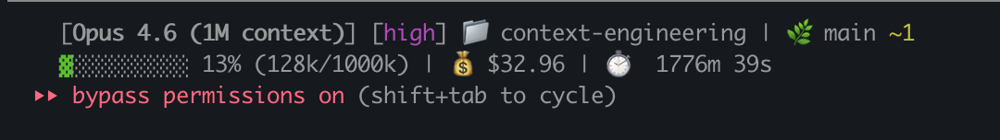

# Context Engineering Plugin

A Claude Code plugin that provides a complete development workflow with specialized agents, research commands, skills, and execution context.

## What This Plugin Provides

The `context-engineering` plugin establishes a comprehensive development methodology:

1. **Research-First Approach**: Specialized agents for exploring codebases before making changes
2. **Plan-Driven Development**: Structured planning with agent consultation before implementation
3. **Thoughts Directory Convention**: Organized storage for tickets, plans, research, PRs
4. **Agent Delegation**: Clear separation between research, planning, and execution agents
5. **Quality Gates**: Verification checkpoints at each implementation phase
6. **Multi-Agent Code Review**: Sequential cleanup followed by parallel specialized reviewers
7. **Autonomous Plan Creation**: 8-agent team that researches, writes, debates, and signs off on plans

## Installation

### From GitHub

Add the marketplace and install:

```bash
/plugin marketplace add dimakrest/context-engineering
/plugin install context-engineering@dimakrest-context-engineering
```

### Installation Scopes

```bash
# Available everywhere (default)
/plugin install context-engineering@dimakrest-context-engineering

# Shared with collaborators (saved in .claude/settings.json)
/plugin install context-engineering@dimakrest-context-engineering --scope project

# Just for you in this repo
/plugin install context-engineering@dimakrest-context-engineering --scope local
```

### Uninstall

```bash
/plugin uninstall context-engineering@dimakrest-context-engineering
```

## Getting Started

After installing the plugin, run the setup command to initialize your project:

```
/context-engineering:setup
```

This creates:
- `.claude/context/` - Execution context files for specialized agents
- `thoughts/shared/` - Directory structure for tickets, plans, research, and PRs

## Available Skills (6)

Skills are triggered by user actions or slash commands.

| Skill | Description |
|-------|-------------|
| `/commit` | Create git commits with user approval |
| `/debug` | Debug issues by investigating logs, database state, and git history |
| `/describe-pr` | Generate comprehensive PR descriptions following repo templates |
| `/code-review-by-team` | Multi-phase PR review: sequential cleanup (simplify, code-cleanup) then parallel reviewers (backend, frontend, QA, security) |
| `/plan-and-review-by-team` | Autonomous 8-agent team for creating detailed, well-reviewed implementation plans with cross-review debate and chief-reviewer sign-off |
| `/setup-statusline` | Install a two-line status bar (see below) |

### Status Line

Run `/setup-statusline` to install a two-line status bar showing model, effort level, directory, git status, context window usage, cost, and duration.



## Available Commands (11)

Commands are invoked as `/context-engineering:<name>`.

### Planning & Research

| Command | Description |
|---------|-------------|
| `/setup` | Initialize project with context files and directory structure |
| `/create-plan` | Create detailed implementation plans through interactive research |
| `/research-codebase` | Document codebase as-is with parallel research agents |

### Implementation

| Command | Description |
|---------|-------------|
| `/implement-plan` | Execute plans with agent delegation and verification |

### Audits

| Command | Description |
|---------|-------------|
| `/security-audit` | Comprehensive security audit with OWASP Top 10, CWE, and CVSS scoring |
| `/scalability-audit` | Scalability assessment with load translation and bottleneck analysis |

### Alternative AI Review

| Command | Description |
|---------|-------------|
| `/gemini-review` | Review PR using Gemini CLI for alternative perspective |
| `/gemini-plan-review` | Review plan using Gemini CLI |

## Available Agents (11)

Specialized subagents spawned by commands and skills.

| Agent | Model | Purpose |
|-------|-------|---------|
| `codebase-locator` | sonnet | Find files and directories relevant to a feature |
| `codebase-analyzer` | sonnet | Analyze how code works with file:line references |
| `codebase-pattern-finder` | sonnet | Find similar implementations to model after |
| `thoughts-locator` | sonnet | Discover documents in thoughts/ directory |
| `thoughts-analyzer` | sonnet | Extract insights from thoughts documents |
| `web-search-researcher` | sonnet | Research web sources for technical information |
| `frontend-engineer` | sonnet | React/TypeScript frontend development |
| `backend-engineer` | sonnet | Python/FastAPI backend development |
| `code-cleanup` | opus | Systematic code cleanup with multi-perspective analysis |
| `security-auditor` | opus | Security vulnerability assessment with OWASP Top 10 and CVSS scoring |
| `scalability-auditor` | opus | Scalability bottleneck assessment with SIS scoring |

## Workflow Overview

```
Ticket -> Research -> Plan -> Review -> Implement -> Test -> Commit -> PR -> Merge
```

### 1. Create a Ticket

Document the task in `thoughts/shared/tickets/YYYY-MM-DD-description.md`:
- Problem statement
- Requirements
- Acceptance criteria
- Out of scope (YAGNI)

### 2. Research the Codebase

```
/context-engineering:research-codebase How does the authentication system work?
```

This spawns parallel research agents to document the current implementation.

### 3. Create a Plan

```
/context-engineering:create-plan thoughts/shared/tickets/2025-01-15-add-auth.md
```

This creates an interactive planning session that:
- Consults appropriate agents (frontend/backend)
- Researches existing patterns
- Creates a phased implementation plan

Or use the autonomous team:

```
/plan-and-review-by-team
```

This launches 8 agents that research, write, debate, and sign off on the plan without user intervention.

### 4. Review an Existing Plan

```
/context-engineering:plan-and-review-by-team thoughts/shared/plans/2025-01-15-add-auth.md
```

Pass an existing plan path to run in review-only mode (skips research and writing, goes straight to team review).

### 5. Implement the Plan

```
/context-engineering:implement-plan thoughts/shared/plans/2025-01-15-add-auth.md
```

This autonomously:
- Delegates to backend-engineer and frontend-engineer agents
- Runs tests after each phase
- Updates plan progress

### 6. Code Review

```
/code-review-by-team
```

This runs a multi-phase review:
1. `/simplify` cleans up code (light pass)
2. `code-cleanup` agent does a deeper pass
3. Backend, frontend, QA, and security reviewers run in parallel
4. Compiled report with Must Fix / Should Fix / Consider findings

## Directory Structure Convention

```
project/
├── .claude/
│   └── context/
│       ├── BACKEND_EXECUTION.md
│       ├── FRONTEND_EXECUTION.md
│       ├── CODE_RESEARCH.md
│       └── WORKFLOW.md
├── thoughts/
│   └── shared/
│       ├── tickets/     # Task descriptions
│       ├── plans/       # Implementation plans
│       ├── research/    # Codebase research
│       └── prs/         # PR descriptions
└── CLAUDE.md            # Project instructions
```

## Customization

After running `/context-engineering:setup`, customize the generated files for your project:

### Context Files

The files in `.claude/context/` are templates. Update them with:
- Your project's specific test commands
- Coverage thresholds
- Project-specific patterns and conventions

### CLAUDE.md Integration

Add references to context files in your project's CLAUDE.md:

```markdown
## Agent-Specific Context

- **Backend Execution**: See `.claude/context/BACKEND_EXECUTION.md`
- **Frontend Execution**: See `.claude/context/FRONTEND_EXECUTION.md`
- **Code Research**: See `.claude/context/CODE_RESEARCH.md`
- **Workflow**: See `.claude/context/WORKFLOW.md`
```

## Key Principles

### Research Before Implementation

All research agents are **documentarians, not critics**. They describe what exists without suggesting improvements.

### Agent Delegation

Complex tasks are delegated to specialized agents:
- Backend changes -> `backend-engineer`
- Frontend changes -> `frontend-engineer`
- Code investigation -> `codebase-analyzer`

### Plan-Driven Development

Every significant change follows the workflow:
1. Document requirements in a ticket
2. Research the codebase
3. Create a detailed plan with agent consultation
4. Implement with verification at each phase

### Quality Gates

- All tests must pass before proceeding to next phase
- Manual verification checkpoints at phase boundaries
- PR review analysis before merge

## Requirements

- Claude Code CLI (v1.0.33+)
- Git and GitHub CLI (`gh`)
- For Gemini commands: Gemini CLI installed and configured

## License

MIT
