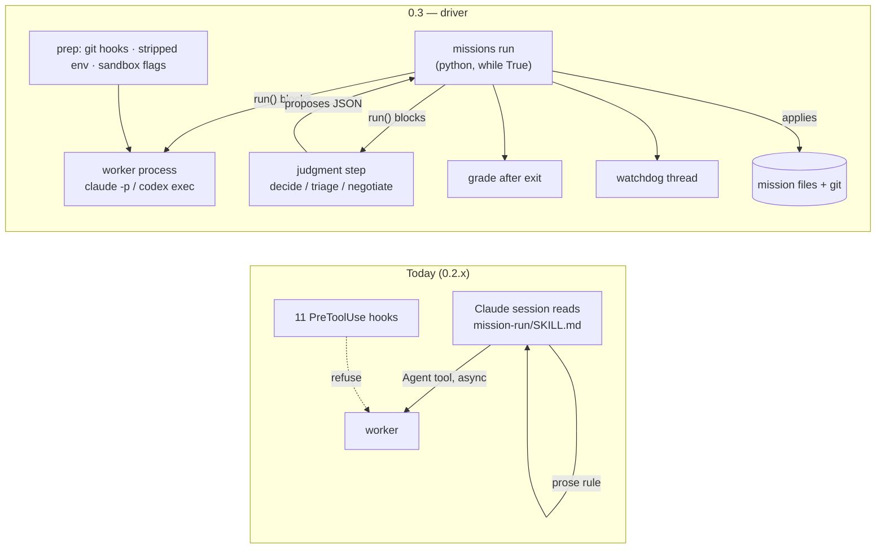
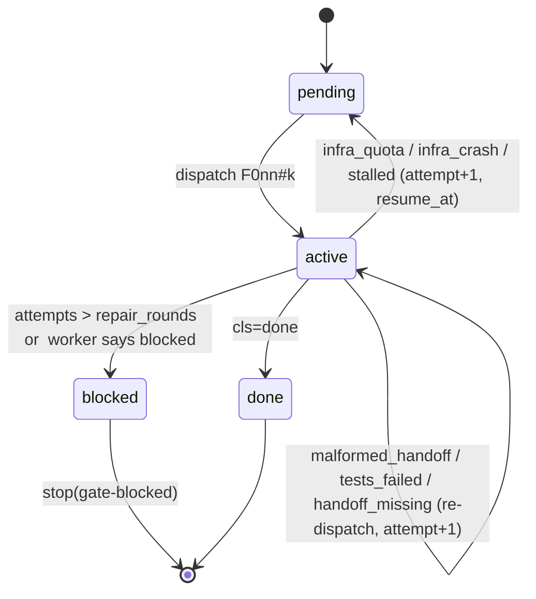

# Missions driver — design

**Status:** approved for build · **Issues:** #12 (decision) · #5 (driver) · #6 (tests) · #4 (grading) · #13 (enforcement) · **Target:** `plugins/missions` 0.3.0 · **Date:** 2026-09-06

This is the interface document. It fixes the things four tickets build against — file layout, the
`run()` adapter contract, the outcome record, journal events, the feature state machine, the stub
protocol, the CLI — so that #4, #7, #8 and #13 can be built by different agents without re-deciding
them. Behaviour that is already specified in a ticket is referenced, not repeated.

## 1. What changes, in one picture



Three sentences carry the whole design:

1. **The driver is a program; the model is a subprocess.** Continuation is a `while True:` that
   exits only through a typed `stop(reason)`. Nothing is awaited that the driver did not launch.
2. **The contract with a worker is files and git.** Prompt in, handoff + commit out, exit code and
   elapsed time. A harness is a ~30-line adapter; the same mission runs under `claude` and `codex`.
3. **The model proposes, the driver applies.** Judgment steps return a structured decision file;
   the driver validates it and edits the mission files. No model edits `state.md`, `features.md`
   or `contract.md` during a run.

## 2. Layout

```
plugins/missions/
  driver/
    missions/                 python package, stdlib only, python ≥ 3.9
      __main__.py             `python -m missions` → cli.main
      cli.py                  run · resume · status · grade · preflight · spend
      loop.py                 the while-True, step selection, stop()
      steps.py                worker · reviewer · scrutiny · behavior · decide · triage · negotiate
      grade.py                post-exit verdict (one function; also `missions grade`)
      watchdog.py             branch/handoff/silence poller, kills a stalled run
      prep.py                 checkout prep: git hooks, env, blindness, locks
      files.py                parsers/writers: state block, features.md, contract.md, followups.md
      journal.py              append + query journal.jsonl
      outcome.py              Outcome dataclass, classify()
      adapters/
        base.py               Adapter protocol, Run request, Capabilities
        claude.py             claude -p
        codex.py              codex exec
        stub.py               shell script plays the agent (tests)
      prompts.py              renders agents/*.md bodies + the dispatch templates
    bin/missions              thin launcher: exec python3 -m missions "$@"
  agents/*.md                 unchanged — body = system prompt; frontmatter mapped per adapter
  hooks/                      unchanged — bonus layer when the harness is Claude (#13)
  scripts/                    unchanged — the driver shells to mission-state.sh, mission-patch.sh,
                              mission-converge.sh, mission-archive.sh, check.sh
  tests/
    run.sh, cases/            unchanged
    traces/                   §9 — driver scenarios over a stub adapter
    mutants.sh                §9
    harness/                  §9 — bounded live smoke per real adapter
```

New per-mission files under `.missions/<slug>/`:

```
driver.json          harness, per-role timeouts/budgets, sandbox flags, checkout (§3)
runs/<task>/         one dir per run: prompt.md · stdout · stderr · outcome.json
decisions/<task>.json  what a judgment step proposed, before the driver applied it
partial/<task>.patch   tree snapshot when a run ends without a clean handoff (#7)
githooks/            pre-commit · pre-push installed via core.hooksPath for the run (§7)
.blind/<task>/       handoffs/ and validation/ parked here during a reviewer run (§7)
.driver.lock         one driver per mission dir (fcntl)
~/.missions/host.lock  one executor per host across missions/worktrees (§7.1)
```

Everything the skills read today (`state.md`, `features.md`, `contract.md`, `handoffs/`,
`followups.md`, `journal.jsonl`, `patches/`, `validation/`) keeps its schema from
`templates/MISSIONS_TEMPLATES.md`. The driver is a second writer of the same files, not a new format.

## 3. Configuration — `driver.json`

Written by `missions init <mission-dir>` from `mission.md` defaults; hand-editable.

```json
{
  "harness": "claude",
  "checkout": ".",
  "branch": "mission/analytics-hour-filter",
  "roles": {
    "worker":    {"timeout_s": 2400, "budget_usd": 8,  "model": "sonnet"},
    "reviewer":  {"timeout_s": 1500, "budget_usd": 6,  "model": "opus", "effort": "xhigh"},
    "scrutiny":  {"timeout_s": 1800, "budget_usd": 4},
    "behavior":  {"timeout_s": 2400, "budget_usd": 10},
    "judgment":  {"timeout_s": 300,  "budget_usd": 2,  "model": "opus"}
  },
  "watchdog": {"poll_s": 30, "commit_no_handoff_s": 300, "silence_s": 900},
  "host_lease": true,
  "adapters": {
    "claude": {"bin": "claude", "permission_mode": "acceptEdits"},
    "codex":  {"bin": "codex",  "sandbox": "workspace-write"}
  }
}
```

`checkout: "."` — the mission runs in the checkout the driver is pointed at, on the mission
branch. **A git worktree is the expected case**: one mission per worktree, the main checkout stays
free, several missions may run side by side (see the host lease in §7.1). `.missions/<slug>/`
lives inside the worktree and is gitignored; the branch is checked out there and nowhere else.
Per-feature worktrees *inside* a mission are **not** the default: features commit serially onto
one branch and the patch/range machinery assumes it. `checkout: "worktree"` is reserved for later;
#13's example that shows `.worktrees/F012` should be read as `checkout`.

Worktrees of one repo share the object store, `origin/*`, and — unless told otherwise — the
repo config, the Compose project name, and the laptop. `missions init` therefore derives
`compose_project` from the worktree path and writes it into the environment manifest (#9);
`preflight` refuses to run when the Compose `working_dir` label points at another checkout (S1's
collision, S1:907) or when `.venv` / `node_modules` / the graphify index are missing from *this*
worktree.

Seats: `features.md` `- **Seat:**` overrides `roles.worker.model` per feature; `mission.md`
"Reviewer seat" overrides `roles.reviewer.model`. Unchanged from 0.2.

## 4. The adapter contract

```python
@dataclass
class RunRequest:
    role: str            # worker | reviewer | scrutiny | behavior | judgment
    task: str            # "F012#2" — feature id + attempt, or "review-F012#1", "decide#7"
    prompt_path: Path    # rendered prompt (system + user parts, see §8)
    cwd: Path            # the checkout
    env: dict            # already stripped/whitelisted by prep (§7)
    timeout_s: int
    budget_usd: float | None
    model: str | None
    effort: str | None
    read_only: bool      # reviewer/judgment: no writes to the tree
    output_path: Path    # where the adapter must leave the agent's final message

@dataclass
class Outcome:
    task: str
    rc: int
    elapsed_s: float
    timed_out: bool
    killed_by: str | None      # "watchdog:commit_no_handoff" | "watchdog:silence" | "timeout" | None
    cost: dict                 # {"unit": "usd"|"tokens"|"unknown", "value": float|None, "source": str}
    harness: str
    model: str | None          # what the harness reports it ran, else None — never a default
    stdout_path: Path
    stderr_path: Path
    cls: str                   # set by classify(), §5

class Adapter(Protocol):
    name: str
    def capabilities(self) -> dict: ...   # {"cost_unit": "usd", "budget": True, "model": True, "read_only": True}
    def run(self, req: RunRequest) -> Outcome: ...   # BLOCKS until the process exits or is killed
```

`run()` must: start exactly one process, stream stdout/stderr to the run dir, honour `timeout_s`
(SIGTERM, 60 s grace, SIGKILL), expose the pid to the watchdog, and never return before the process
is gone. Cost is filled from what the harness reports; `unknown` is a valid and common answer.

| Adapter | Command shape (verify flags at implementation) | Cost | Read-only |
|---|---|---|---|
| `claude` | `claude -p --output-format json --max-budget-usd B --model M [--permission-mode …] [--allowedTools …] --append-system-prompt-file sys.md < user.md` | `total_cost_usd` from the JSON result | `--allowedTools` without Write/Edit; `--disallowedTools Write,Edit` |
| `codex` | `codex exec -C cwd --sandbox workspace-write -m M --json -o output.md "$(cat user.md)"` with the system part prepended to the prompt | token counts from `--json` events → `unit: tokens` | `--sandbox read-only` |
| `stub` | `bash $MISSIONS_STUB_SCRIPT` with §9's env | whatever the script writes to `$MISSIONS_RUN_DIR/cost.json`, else `unknown` | env flag only |

Both real adapters land in the same PR as the loop (#5). The abstraction is proven by the second
implementation, not assumed from the first.

## 5. Outcome classes and the feature state machine

`classify(outcome, grade)` runs after exit and produces exactly one class:

| `cls` | When | Loop action |
|---|---|---|
| `done` | rc 0 · handoff valid · commit on branch · tree clean · claims graded | feature → `done`; ingest |
| `handoff_missing` | commit on branch, no handoff (watchdog or exit) | reconstruct from diff, mark `reconstructed`, grade; if grade fails → `malformed_handoff` |
| `malformed_handoff` | handoff present, grade rejects (schema, exit codes, commit not in log, claim without falsifier row #8) | attempt+1 → re-dispatch with the rejection text; after `repair_rounds` → `blocked` |
| `tests_failed` | handoff says `partial`/`blocked` or a listed command has non-zero exit that the handoff does not explain | same as malformed |
| `infra_quota` | stderr/stdout matches the harness's quota/limit pattern, or rc says so | snapshot tree (#7), `resume_at` = parsed reset or +60 min; **driver sleeps**, then re-dispatches the same attempt |
| `infra_crash` | rc ≠ 0 with no handoff and no commit and no quota signature | attempt+1; two in a row → `stop(error)` |
| `stalled` | killed by watchdog silence | snapshot; treat as `infra_crash` |
| `no_op` | rc 0, no commit, no handoff, tree clean | attempt+1 with a sharper prompt; second → `blocked` |

Feature statuses stay `pending → active → done | blocked` (templates unchanged). The attempt
counter lives in the journal, not in `features.md`. A `blocked` feature blocks its milestone —
nothing later in the queue starts (MCMV's "one failed feature silently disabled its own gate"
lesson, `mc:2077–2085`).



## 6. The loop and the steps

```python
def run(mission, args):
    preflight()                       # check.sh, design.md present, contract sealed, branch checked out, lock
    while True:
        s = load_state()
        if r := stop_condition(s): return stop(r)          # caps, halted, phase done, --limit
        if s.open_issues:            step_triage(s);        continue   # judgment → applied → loop
        if milestone_complete(s):    validate(s);           continue   # §6.2
        f = next_feature(s)          # pending, deps done, milestone == current
        if f is None:                return stop("done" if all_done(s) else "gate-blocked")
        outcome = step_worker(f)     # prep → run() → grade → classify → ingest → journal
```

Deterministic where a rule exists; a judgment step only where the SKILL today says "decide".

### 6.1 Mechanical steps (the driver does these itself — no model)

- **Ingest** (`handoff_ingested`): range = previous head..this commit; `mission-patch.sh` for the
  reviewer packet; `features.md` status + Range; `contract.md` → `claimed` (never `proven`);
  copy handoff issues into `state.md` open issues; rewrite `resume_next`; `graphify update` when the
  digest names it.
- **Verdict application**: a reviewer/validator's per-assertion table is parsed from its output
  file; `proven` is written only from a validator verdict.
- **Convergence**: `mission-converge.sh`; exit 2 → `stop(gate-blocked)`.
- **Archive**: `mission-archive.sh` when a milestone closes.
- **Spend**: per-run `cost` events summed; `spend_usd` in the state block with its **age**
  (#10): `spend_usd: 41.80 (usd, 00:03 old)`.

### 6.2 VALIDATE sequence

Order fixed by the SKILL: scrutiny (one run) → blind review (one run **per feature**, serial) →
behavior (only if the milestone has `conversational`/`interface` assertions) → **negotiate**
(judgment) → converge → advance or schedule repairs. Every run has a deadline from `driver.json`.
There is no forked skill and no background dispatch anywhere in this sequence (S3's 9 h 15 shape
cannot occur: the driver launched everything it waits for).

### 6.3 Judgment steps — the model proposes, the driver applies

| Step | Input (prompt) | Output file (schema-validated) | Driver applies |
|---|---|---|---|
| `decide` | digest + last outcome + the SKILL's decision rules | `{"action": "dispatch"|"validate"|"halt", "feature": "F0nn", "class": "advisory"|"block", "reason", "assumption"}` | journals; a `halt/block` becomes `stop(gate-blocked)` with the decision card |
| `triage` | open issues + handoff | `{"resolutions": [{"issue": "...", "disposition": "resolved"|"defer", "followup": {...}}]}` | edits `state.md` open issues, appends `followups.md` |
| `negotiate` | all verdicts of the milestone + `followups.md` | `{"findings": [{"cluster": "C0n", "severity", "blocking", "disposition": "repair F0nn"|"accept"|"waive"}], "repairs": [{"feature": "F0nn", "title", "assertions": [...], "files": [...], "milestone": "M2"}], "contract_wrong": false}` | appends follow-ups and repair features; `contract_wrong: true` → `stop(contract)` |

A judgment run is read-only (`read_only: true`), has a 5-minute default deadline, and its output is
rejected if it does not parse — then re-run once with the parse error, then `stop(error)`. The
model never touches the mission files; that is the property that makes the run replayable and
makes a Codex orchestrator possible.

### 6.4 Stop reasons

`stop(reason, detail, needs)` writes `{"event":"stop", …}` to the journal, sets `phase: halted`
(or `done`) and `resume_next` in `state.md`, releases locks and hooks (§7), and exits with a
distinct code:

| reason | exit | `needs` |
|---|---|---|
| `done` | 0 | — (phase → `done`; terminal steps are `missions run --phase pr`, see §6.5) |
| `limit-reached` | 3 | re-run |
| `budget` | 4 | cap raise with a fresh spend figure (#10) |
| `gate-blocked` | 5 | the decision card in `state.md` |
| `authority` | 6 | a grant in `mission.md` (#10) |
| `contract` | 7 | `/missions:mission-amend` |
| `provider-quota` | 8 | nothing — only when `resume_at` is beyond `--max-sleep` |
| `preflight-failed` | 2 | fix the mission files |
| `error` | 1 | look at `runs/<task>/stderr` |
| `interrupted` | 130 | `missions resume` |

### 6.5 Terminal phase

`missions run --phase pr` runs the terminal steps as ordinary steps: pre-merge sweep, docs update
(worker role), `phase: pr`, push **by the driver** (the only process that ever has push
credentials, §7), the PR-review pass as a `reviewer` run with the whole-branch packet, final report
via `journal-metrics.sh`. `merge-main` runs here iff `mission.md` grants it (#10). PR merge: never.

## 7. Prep — enforcement without harness hooks (#13)

Per run, `prep.py`:

1. **Lock + lease.** `.driver.lock` (fcntl) — one driver per mission. Write `.writer`/`.lease` in
   the 0.2 format so a concurrent Claude session's hooks still see the run.
2. **Git hooks — via the environment, never the repo config.** `core.hooksPath` is repository
   config and is shared by every worktree of the repo; writing it would install mission hooks in
   the main checkout too and leave them there after a crash. Instead the worker env carries
   `GIT_CONFIG_COUNT=1 GIT_CONFIG_KEY_0=core.hooksPath GIT_CONFIG_VALUE_0=.missions/<slug>/githooks`
   (git ≥ 2.31), so the hooks exist only for processes the driver launches and nothing needs
   restoring. The installed `pre-commit` first execs the repo's original hook path (pre-commit
   framework, husky, whatever `git config core.hooksPath` or `.git/hooks` names), then mission
   checks: branch is the mission branch, message starts with `F0nn:` for worker runs, no file
   outside `features.md` **Files** without a declared reason. `pre-push` exits 1 unless
   `MISSIONS_PUSH_TOKEN` matches a nonce the driver sets only in its own push subprocess — workers
   never have it.
3. **Env whitelist.** Worker env is built, not inherited: `PATH HOME LANG LC_* TERM TMPDIR` + the
   harness's own auth variables + `MISSIONS_*`. Dropped: `GH_TOKEN GITHUB_TOKEN GIT_ASKPASS
   SSH_AUTH_SOCK` and any `*_TOKEN`/`*_SECRET` not on the harness list. `GIT_CONFIG_GLOBAL` points
   at a driver-written file carrying only `user.name`/`user.email` (copied from the real config)
   and `credential.helper=` (empty) — push/merge become *impossible*, not forbidden.
   `GIT_TERMINAL_PROMPT=0`.
4. **Sandbox flags** per adapter from `driver.json`; `read_only` roles get the harness's read-only
   mode.
5. **Blindness.** For `reviewer` runs, `handoffs/` and `validation/` are renamed into
   `.blind/<task>/` for the duration and restored after — hidden, not forbidden. The prompt carries
   only the patch path. `runs/` and `decisions/` are chmod 000 for the same window.
6. **Serial by construction — per mission and per host.** One executor at a time within a mission
   is a property of the loop; the `.lease` file is for the benefit of foreign Claude sessions.
   Across missions see §7.1.
7. **Mission env** for every run: `MISSIONS_ROLE MISSIONS_FEATURE MISSIONS_TASK MISSIONS_DIR
   MISSIONS_RUN_DIR MISSIONS_PHASE MISSIONS_HARNESS`.

Claude's hooks stay installed and keep working when the harness is Claude. They are never what the
driver relies on.

### 7.1 Host execution lease

Two missions in two worktrees are two drivers that cannot see each other's `.lease`, and two test
suites on one laptop manufacture phantom regressions (S3 M2: five false failures, ~30 min). Every
driver therefore takes `~/.missions/host.lock` (fcntl, holder = mission dir + task + pid) around
every **executor** run — worker, reviewer, scrutiny, behavior — and journals `lease_wait` with the
holder while it waits. Judgment steps and static research do not take it. A mission opts out with
`"host_lease": false` in `driver.json` only when its environment manifest (#9) names its own
Compose project, ports and database; `preflight` verifies that claim. A lock whose pid is dead is
stale and is broken with a journal entry.

## 8. Prompts

`agents/<role>.md` is the single source. The body is the system prompt; frontmatter maps:
`model`/`effort` → `RunRequest`; `tools` → `--allowedTools` (claude) or ignored (codex, where the
sandbox mode is the guard). The user part is the dispatch template from `mission-run/SKILL.md`,
rendered by `prompts.py` with the digest (`mission-state.sh`), verbatim assertions, verbatim design
guidelines and procedures — first line `Mission: <slug>. Feature: F0nn — …`, unchanged, so the 0.2
hooks keep parsing it. The rendered prompt is saved to `runs/<task>/prompt.md`; a trace can assert
on it.

Worker prompts gain two lines: *"Do not spawn background work or sub-agents"* and *"Before
finishing, run `missions grade F0nn --self` and fix what it reports"* — the same verdict function
the driver will apply (#4).

## 9. Tests (#6)

```
tests/traces/<name>/
  mission/            fixture → <tmp>/.missions/<slug>/  (driver.json has "harness": "stub")
  repo.sh             builds the git fixture in <tmp>/repo (branch, base commit, origin/main)
  stub/<role>.sh      the stub agent for that role; stub/F003.sh overrides worker for one feature
  expect              rc=<n> · journal~=<regex> (repeatable, in order) · journal!~=<regex>
                      git~=<regex on `git log --oneline`> · state~=<regex on the state block>
                      file=<path> · nofile=<path> · postcheck=<shell> · env=K=V · args=<argv>
```

Stub env: `MISSIONS_ROLE MISSIONS_FEATURE MISSIONS_TASK MISSIONS_DIR MISSIONS_RUN_DIR
MISSIONS_PROMPT MISSIONS_STUB_SCRIPT`; the script may commit, write handoffs/verdicts, sleep, write
`cost.json`, and exit with any rc. A stub that writes `$MISSIONS_RUN_DIR/output.md` plays a
judgment step.

Required traces (each is the acceptance test of a ticket): `launch-grades-nothing` ·
`commit-without-handoff` (#4) · `duplicate-completion-once` (#4) · `quota-schedules-resume` (#7) ·
`interrupt-before-and-after-commit` (#7) · `claim-without-falsifier-rejected` (#8) ·
`wrong-checkout-refused` (#9) · `authorised-merge-main-vs-pr-merge` (#10, #13) ·
`converge-ignores-closed-rows` (#11) · `reviewer-cannot-see-handoffs` (#13) ·
`worker-cannot-push` (#13) · `two-drivers-one-host` (second driver waits on the host lease and
journals `lease_wait`) · `fork-shape-impossible` (a stub that spawns a background child; the
driver must still return on the parent's exit and never wait for the child).

`tests/mutants.sh`: applies a named `sed` mutation to a driver module, runs the trace that must
fail, restores, reports. Mutations: grade-at-launch · drop-watchdog · drop-phase-check ·
skip-credential-strip · skip-blindness · count-all-followups.

`tests/harness/`: the `commit-without-handoff` and `worker-cannot-push` traces run with
`harness: claude` and `harness: codex` against the stub repo, with a tiny real prompt; asserts the
journal has the same event shape and the same classes under both. Bounded by `budget_usd: 0.50`.

## 10. CLI

```
missions init     <mission-dir> [--harness H]        write driver.json from mission.md
missions preflight <mission-dir>                     check.sh + design + branch + adapters present
missions run      <mission-dir> [--harness H] [--milestone M] [--limit N] [--until validate|milestone]
                                 [--phase pr] [--max-sleep 2h] [--dry-run]
missions resume   <mission-dir>                      reconcile git ⇄ files ⇄ journal, then run
missions status   <mission-dir> [--handover] [--json] projection of journal + files + git (#11)
missions grade    <mission-dir> F0nn [--self]        the verdict function; --self = worker mode
missions spend    <mission-dir>                      cost with age and unit (#10)
```

`/missions:mission-run` (Claude) becomes: if `missions` is on PATH → `missions run … &` and tail
`journal.jsonl`; otherwise the 0.2 prose loop with a deprecation note. Codex gets an `AGENTS.md`
paragraph with the same two commands. `mission-plan`, `mission-design`, `mission-crosscheck`,
`mission-amend` stay interactive skills — planning is a conversation; running is not.

## 11. Non-goals

No auto-merge. No PR merge by anything. No push except by the driver in phase `pr`. No parallel
writers. No mandatory per-milestone approval gate. No remote gate channel. No per-feature worktrees
in this version. No code copied from MCMV — the pattern only, with these differences: no
`--no-verify`, no config stripping, no checkpoint pushes, git hooks chained not replaced.

## 12. Build order and milestones

| Step | Delivers | Acceptance |
|---|---|---|
| D1 | package skeleton, `files.py`, `journal.py`, loop with worker step, **stub adapter**, `init`/`preflight`/`run --dry-run` | `launch-grades-nothing`, a two-feature happy-path trace |
| D2 | `grade.py`, `watchdog.py`, `classify()`, ingest | `commit-without-handoff`, `duplicate-completion-once` (#4) |
| D3 | `prep.py` (hooks, env, blindness), **claude adapter**, VALIDATE sequence, judgment steps | `worker-cannot-push`, `reviewer-cannot-see-handoffs`, first `tests/harness` smoke (#13) |
| D4 | **codex adapter**, `mutants.sh`, `resume`, `status --handover` | both harness smokes green; all six mutants kill their trace (#6) |
| D5 | replay `analytics-hour-filter` on the driver | baselines: prompts 0 · false alarms 0 · spend records 1/run · longest stall < deadline |

D1–D2 are one PR (the loop is not reviewable without grading). D3 and D4 are separate PRs. #7, #8,
#9, #10, #11 start after D2 against the interfaces above and are delegable.

## 13. Open questions (decide during D1, do not block on them)

- Exact `claude -p` flag set for a read-only run and for `--append-system-prompt-file` (verify
  against the installed CLI; fall back to prepending the system part to the user prompt as codex
  does).
- Whether `codex exec --json` reports token usage per run in the installed version; if not, `unit:
  unknown` and a note in `status`.
- macOS `python3` is 3.9 on older systems; the package must not use `match` or `|` unions at
  runtime (annotations are fine under `from __future__ import annotations`).
